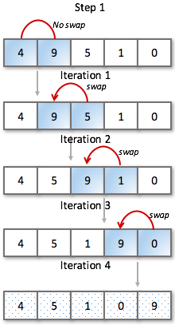
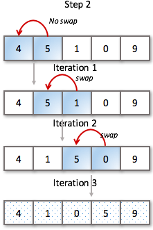
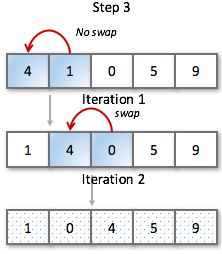
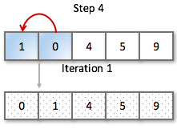
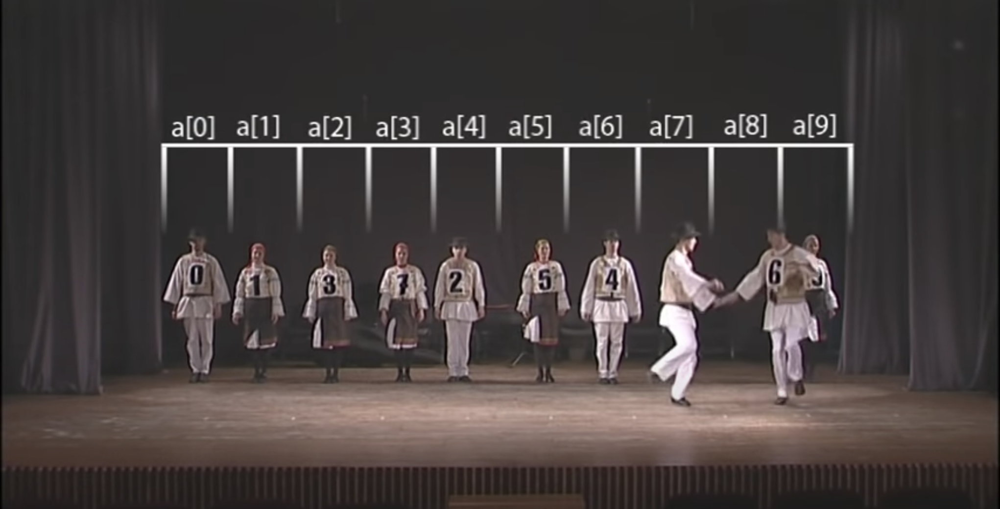

# Bubble Sort

**Bubble Sort** or **Sinking Sort** is a simple sorting method that will sort an array by comparing adjacent elements in an array and swaps their positions if they are in the wrong order. In effect causing each item to "bubble" to the position it belongs.

Bubble Sort is mainly used to introduce the concept of an algorithm, or a sorting algorithm and due to poor performance not widely used in the "real world."

## Diagram

[Visual](https://visualgo.net/en/sorting)

## Time Complexity

### Worst Case Complexity: O(n2)

When the array is not sorted this sorting algorithm uses nested loops to compare all items and sort them. This sorting algorithm performs poorly with large data sets or if the data set is in a reversed order.

`array = [7,6,5,4,3,2,1]`

### Best Case Complexity: O(N)

Bubble Sort can have near linear time on an already sorted array in the case that the code has been optimized.

`array = [1,2,3,4,5,6,7]`

`array = [7,1,2,3,4,5,6]`

### Use Cases

This simple algorithm performs poorly in real world use and is used primarily as an educational tool.

#### Resources

[E Question Answers](equestionanswers.com/c/c-bubble-sort.php)

[Bubble Sort Wikipedia](https://en.wikipedia.org/wiki/Bubble_sort)
